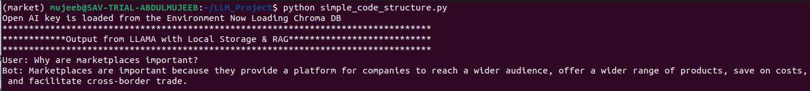
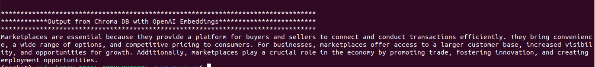
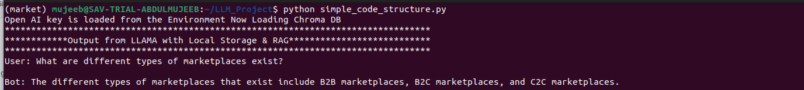
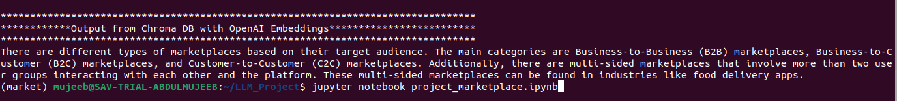

# LLM-RAG-Chroma-Prompt :speech_balloon:
This repository belongs to the trial project given by Gaditek for the Test Purposes. Syed Umaid has written this code in a way to run it through dual functionality (Local Database with llama and Chroma) Seperately

# Project Title

Objective is to create a simple Q/A bot by using RAG technique in an LLM like OpenAI Llama or Mistral. Create a simple Q/A bot that will answer user's
questions from a given knowledge. To store the knowledge use Vector Database and embeddings. Use LLM to answer user questions in natural language.


## Getting Started
Developers have divided the Tasks into three main Sections 

### Prerequisites

You need to have an OpenAI key for the purpose of generating embeddings. While running the code, in order to save the Key for Public Disposal. First Create the Environment. Then Save the Key There.

```
nano .env
OPEN_AI_KEY = "sk-xxxxxxxxxxxxxxxxxxxxxxxxxxxxxxxxxxxxxxxxxxxxxxxxxxxxxxxxxxxxxxx"
```

### Installing

A step by step series of examples that tell you how to get a development-env running

Make the Virtual Environment with Version of Python=3.9. Run the "requirements.txt" file in the Virtual Environment

```
pip install -r requirements.txt
```


## Running the tests 
1. LLAMA with RAG: We've used local database and LLAMA for querying the Response :point_left:
2. Chroma DB with OpenAI Models: We've used Chroma database and LLM for querying the Response :point_left:


### Prompting/Coding style For the Exact Similar Output in Trial Examination Questionarre

From llama_index.core we have used the Prompt Library in order to design the Prompt in the Desired Format.
The "qa_template" used is producing the outputs in the required format as requested in the paper sample.


```
    template = (
        "We have provided context information below. \n"
        "---------------------\n"
        "{context_str}"
        "\n---------------------\n"
        "Given this information, please answer the question and each question should start with the word User: and each answer should start with code word Bot: {query_str}\n"
    )

```

## Data Ingestion of Content

The two PDF's are used for guiding the developed Chatbot. The PDF's are available in the "data" folder


### The Outputs generated can be visualized in the Provided Screenshot 

We have provided the :arrow_right: Jupyter Notebook & Also the :arrow_right: python_script for smooth testing of the designed project
:white_check_mark: First Activate the Environment named as "market" and then Run the code


```
python simple_code_structure.py
```

### The Outputs generated can be visualized in the Provided Screenshot 
:heavy_check_mark:



:heavy_check_mark:



:heavy_check_mark:


:heavy_check_mark:



## Built With

* [OpenAI](http://www.dropwizard.io/1.0.2/docs/) - To Generate the Embeddings
* [LLAMA](https://docs.llamaindex.ai/en/stable/) - For RAG and Local Storage Functions

## Contributing

Please read [CONTRIBUTING.md](https://gist.github.com/PurpleBooth/b24679402957c63ec426) for details on our code of conduct, and the process for submitting pull requests to us.


## Authors

* **Syed Umaid Ahmed** - *Initial work* - [Researcher](https://github.com/SyedUmaidAhmed)


## License

This project is licensed under the Free License - To Test and Reproduce the Results

